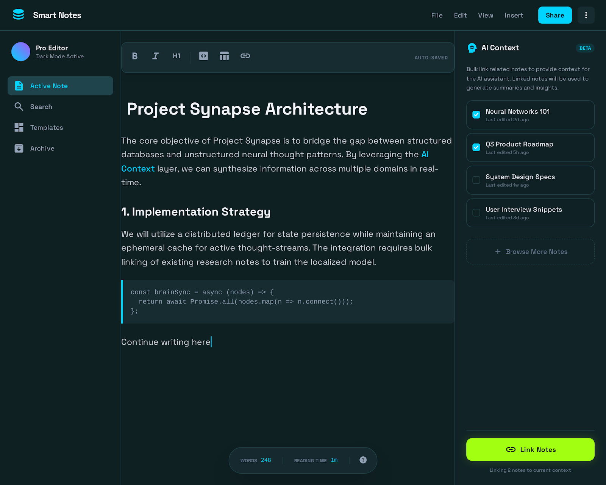
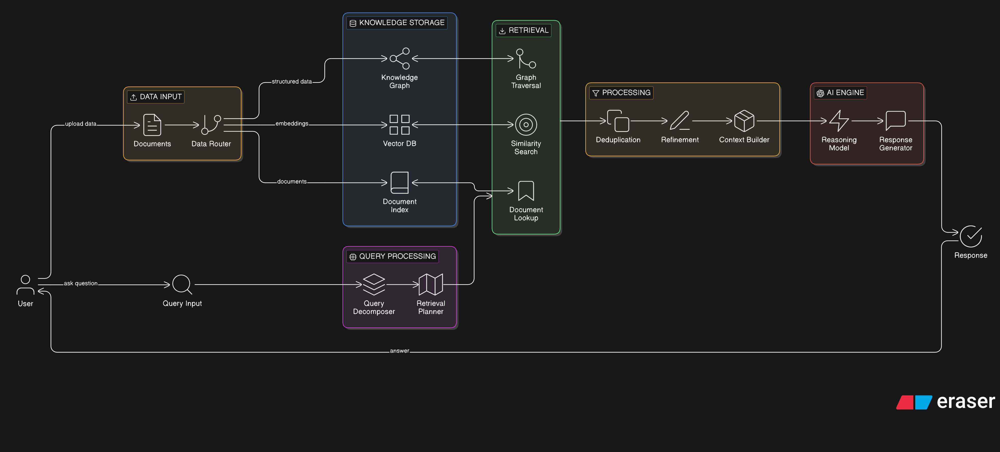

# INTRODUCTION
Hello everyone,

My name is **Nikhil Agrawal**, and I am excited to present the proposed pipeline for this project for GSOC 2026.

This document provides a clear overview of the complete architecture, covering both the **frontend** and the **backend**, and highlights how each part of the system works together to build a complete and efficient solution.

## About Me

If you would like to explore my background and previous work, you can find them here:

- **Website:** https://portfolio-eight-omega-35.vercel.app/
- **GitHub:** https://github.com/nikhil-agrawal123

## The Idea

### Frontend
Let me start with a visual preview of the proposed design and how the Electron-based setup could look.

#### UI Preview 1

#### UI Preview 2

#### UI Preview 3

#### UI Preview 4

### Features of the UI
The proposed UI is designed to be practical, familiar, and efficient for everyday note-taking and AI-assisted workflows. Some of the key interface features include:

- A clean **editor workspace** for writing and organizing notes.
- **File saving** support with a structured and intuitive layout.
- A **nested file tree** for better note and folder management.
- A separate **chat panel** for AI interactions, inspired by the experience of the VS Code Copilot view.
- A **share feature** for sending selected content or multiple selected items directly to the chat area.
- Support for **opening existing files and folders** from the local system.
- Rich **styling and formatting tools** powered by the existing Tiptap editor capabilities.

### Possible Future Enhancements

If time permits, the project can also be extended with additional improvements such as:

- A dedicated **search** experience for quickly finding notes.
- **Note templates**, similar to the document templates available in Google Docs.
- An **archive or deleted items section** to keep removed files organized and recoverable.

### Current Progress

An initial version of the editor has already been explored in earlier commits, where I implemented some of the core features and used CodeRabbit feedback to validate and refine the direction of the idea.

### Frontend Considerations

For the frontend, the primary focus is on usability, consistency, and cross-platform compatibility rather than heavy scalability concerns. Since the application will run locally on each user's system, the main implementation considerations involve ensuring a smooth experience across **Windows**, **macOS**, and **Linux**, along with any platform-specific optimizations that may be required.

## Backend

The backend is one of the most important parts of this project, as it requires careful design decisions to ensure strong local AI capabilities without placing too much load on a user's system.

### Phase 1: Initial Setup

The first step in the backend implementation is to evaluate suitable **local LLMs** and understand the amount of system load they introduce. Models such as **Qwen**, **Llama**, or similar open-source models in the **0.5B to 7B parameter range** can be explored as potential options.

The goal at this stage is to select models dynamically based on the hardware capacity of the user's system, allowing the application to remain responsive and practical across a wide range of device specifications.

Another promising direction is to explore the use of **AirLLM** as an open-source alternative to **Ollama**. This may make it possible to run comparatively larger models on weaker systems, although it may come with a trade-off in response time. This could be exposed as a user-facing option, allowing users to prioritize either **better model quality** or **faster performance**, depending on their preferences and hardware.

### Data Storage and Retrieval

The second major area of exploration is how the application should divide, store, and retrieve note content efficiently. An initial approach could involve a **vector database** combined with **recursive chunking**, where chunks are created based on the document structure, such as headings, subheadings, and content boundaries, rather than relying only on fixed-size splits.

As the system evolves, this can be further improved by exploring more advanced retrieval strategies such as **GraphRAG** or newer **pagination-based retrieval approaches**, which may offer better accuracy and context preservation compared to basic recursive chunking alone.

### Retrieval to Response Pipeline

Once the retrieval stage has identified the most relevant context, that information can be passed to the AI model to generate a final response. This keeps the generation step grounded in the user's actual notes and documents rather than relying only on the model's general knowledge.

### Explainability and Observability

To improve explainability and user trust, the system can include a **LangChain-based orchestration layer** to capture the retrieval and reasoning flow in a structured way. This would make it easier to inspect how documents were processed, which sources were selected, and how the final answer was formed, without depending heavily on ad hoc `print` statements during development and testing.

For user-facing explanations, a graph-based library such as **NetworkX** in Python could be used to visualize how data is connected, retrieved, and filtered. This would help users better understand how the system navigates their knowledge base, while also offering a possible foundation for identifying and pruning dangling or low-relevance nodes from the retrieval graph.

### Retrieval Strategy

If the system is built on a **vector database**, a **hybrid retrieval** approach can be used by combining:

- **Vector similarity search** for semantic relevance
- **Keyword-based search** such as **BM25** for lexical relevance

If the system evolves toward **graph-based** or **pagination-based** retrieval, then a more specialized retrieval algorithm can be used to identify the most relevant context from the document set.

### Proposed Workflow

The overall workflow can be structured as follows:

1. **User submits a query**
2. **Query decomposition** is performed to extract additional context or sub-questions
3. If files are explicitly provided, they are used to build or update the **knowledge base**
4. Otherwise, the system searches the currently open workspace for the most relevant documents
5. The retrieval pipeline selects the most useful sections from those documents
6. The selected context is passed to the **AI model**
7. The model generates a clear, grounded, and user-focused response

### Ai Architecture 

## The overall Idea for end-user Setup
I would like to propose a **Docker-based setup** for the backend and frontend in order to keep deployment simple, reproducible, and user-friendly.

In this approach, the Docker environment can host a local instance of **Ollama** along with the required database services behind a **localhost-based API**. This keeps the **backend** and **frontend** clearly separated, instead of overloading the frontend application with all runtime setup responsibilities.

The **frontend** can remain an **Electron-based desktop application**, as discussed earlier in this proposal, while the backend services run independently in a controlled containerized environment.

### Alternative Packaging Option

If Docker is not used, the project would still need a packaged setup that includes **Ollama integration** along with the required commands or onboarding flow for pulling and configuring the necessary language models.

## Possible API Endpoints

The following endpoints outline a possible backend API structure for ingestion, retrieval, execution, and explainability.

### Core Endpoints

- `/ingestion`
- `/ingestion/{other-data-types}`
- `/query`
- `/query_decomposition`
- `/execute`
- `/output`

### Vector-Based Endpoints

- `/chunking`
- `/relation`
- `/entities`

### Graph-Based Endpoints

- `/traversal`

### User Explanation Endpoints

- `/graph`
- `/score`
- `/trust_score`

## AI Disclosure

The ideas presented in this document are primarily based on my own understanding of the topic, supported by research references and further refinement through AI-assisted exploration.

Some supporting ideas were discussed with **Google Gemini 3 Pro**, and the styling and language polishing of this document were assisted by **GPT-5.4**.

Open to further revisons and discussions with mentors 

Thank You.
